# 1. E-formulieren en notificaties en de Wet modernisering bestuurlijk verkeer

_Auteur_\
Francesca Vonk MSc - Senior UX Designer\
Vereniging voor Nederlandse Gemeenten

# 2. Inhoudsopgave

- [1. E-formulieren en notificaties en de Wet modernisering bestuurlijk verkeer](#1-e-formulieren-en-notificaties-en-de-wet-modernisering-bestuurlijk-verkeer)
- [2. Inhoudsopgave](#2-inhoudsopgave)
- [3. Introductie](#3-introductie)
  - [3.1. Totstandkoming handreiking](#31-totstandkoming-handreiking)
  - [3.2. Doel van deze handreiking](#32-doel-van-deze-handreiking)
  - [3.3. Doelgroep](#33-doelgroep)
  - [3.4. Samenwerkingspartners](#34-samenwerkingspartners)
- [4. Wet Modernisering Elektronisch Bestuurlijk Verkeer](#4-wet-modernisering-elektronisch-bestuurlijk-verkeer)
  - [4.1. Wmebv samengevat in vier punten](#41-wmebv-samengevat-in-vier-punten)
  - [4.2. Wat zijn 'Formele berichten'?](#42-wat-zijn-formele-berichten)
  - [4.3. Wmebv schematisch weergegeven](#43-wmebv-schematisch-weergegeven)
- [5. Theorie: Ontwerpcriteria voor het ontwerpen en toetsen van e-formulieren en notificaties](#5-theorie-ontwerpcriteria-voor-het-ontwerpen-en-toetsen-van-e-formulieren-en-notificaties)
  - [5.1. Digitale Toegankelijkheid en Gebruikersvriendelijkheid](#51-digitale-toegankelijkheid-en-gebruikersvriendelijkheid)
  - [5.2. Rechtsgeldigheid en Authenticatie](#52-rechtsgeldigheid-en-authenticatie)
  - [5.3. Privacybescherming](#53-privacybescherming)
  - [5.4. Veiligheid](#54-veiligheid)
  - [5.5. Aanpasbaarheid en Responsiviteit](#55-aanpasbaarheid-en-responsiviteit)
  - [5.6. Duidelijke Instructies en Hulpfuncties](#56-duidelijke-instructies-en-hulpfuncties)
  - [5.7. Notificatie-Inhoud en Timing](#57-notificatie-inhoud-en-timing)
  - [5.8. Testen met Gebruikers](#58-testen-met-gebruikers)
  - [5.9. Ontwerpcriteria samengevat](#59-ontwerpcriteria-samengevat)
- [6. Praktijk: Ontwikkeling van generiek e-formulier op basis van NL Design System](#6-praktijk-ontwikkeling-van-generiek-e-formulier-op-basis-van-nl-design-system)
  - [6.1. Project achtergrond en doelstelling](#61-project-achtergrond-en-doelstelling)
  - [6.2. NL Design System](#62-nl-design-system)
    - [6.2.1. Design Tokens](#621-design-tokens)
    - [6.2.2. Het Estafette model](#622-het-estafette-model)
  - [6.3. Globaal: Aanpak ontwikkeling generiek e-formulier](#63-globaal-aanpak-ontwikkeling-generiek-e-formulier)
    - [6.3.1. Samenwerking](#631-samenwerking)
    - [6.3.2. Voorbereiding](#632-voorbereiding)
    - [6.3.3. Ontwerp](#633-ontwerp)
      - [6.3.3.1. Scenario](#6331-scenario)
      - [6.3.3.2. User Journey](#6332-user-journey)
      - [6.3.3.3. Tooling](#6333-tooling)
    - [6.3.4. Ontwikkeling](#634-ontwikkeling)
    - [6.3.5. Testen met gebruikers](#635-testen-met-gebruikers)
  - [6.4. Specifiek: Uitwerking generiek e-formulier](#64-specifiek-uitwerking-generiek-e-formulier)
    - [6.4.1. Figma ontwerpen en Wmebv-ontwerpadviezen](#641-figma-ontwerpen-en-wmebv-ontwerpadviezen)
    - [6.4.2. Development en Code Snippets](#642-development-en-code-snippets)
    - [6.4.3. Usability Testresultaten](#643-usability-testresultaten)
- [7. Bronnen en overige informatie](#7-bronnen-en-overige-informatie)
  - [7.1. Stappenplan implementatie Wmebv](#71-stappenplan-implementatie-wmebv)
  - [7.2. Bronnen](#72-bronnen)
  - [7.3. Interessante links](#73-interessante-links)
  

# 3. Introductie

## 3.1. Totstandkoming handreiking

Deze handreiking is tot stand gekomen in opdracht van de Vereniging van Nederlandse Gemeenten Realisatie (VNGR) in samenwerking met NL Design System. Voor de handreiking zijn verschillende bronnen gebruikt. Naast desk-research is er een generiek e-formulier op basis van het NL Design System ontworpen en ontwikkeld. Het generieke e-formulier en de bijbehorende scenario's zijn ontwikkeld om inzage te geven in hoe enerzijds omgegaan zou kunnen worden met producten die nog niet beschikken over een e-formulier en anderzijds om te laten zien hoe met het gebruik van NL Design System binnen een relatief korte tijd gekomen kan worden tot een gebruikersvriendelijk en toegankelijk e-formulier. Het e-formulier en de bijbehorende vervolgschermen, en daarmee dus het scenario, zijn voorgelegd aan experts binnen de VNG, de NL Design System Community en tevens getoetst door Stichting Accessibility zodat deze handreiking in de praktijk gevalideerd is.

## 3.2. Doel van deze handreiking

De doel van deze handreiking is om inzichten te delen betreft het ontwerpen en ontwikkelen van een generiek e-formulier op basis van NL Design System zodat deze voldoet aan de wet modernisering bestuurlijk verkeer (Wmebv). Tevens wordt gekeken naar wat de Wmebv betekent voor notificaties. De volgende onderwerpen worden in deze handreiking behandeld:

- Wmebv in het kort
- Ontwerpcriteria voor het maken van Wmebv proof e-formulieren en notificaties
- Het ontwerpen en ontwikkelen van een generiek formulier met behulp van NL Design System voor een brede generieke inzet.
- Implementatieadviezen met betrekking tot het Wmebv proof maken van e-formulieren en notificaties.

## 3.3. Doelgroep

Deze handreiking is bestemd voor ieder die meer te weten wil komen over het Wmebv proof maken van e-formulieren en notificaties.

## 3.4. Samenwerkingspartners

Deze handreiking en de bijbehorende schermvoorbeelden zijn een samenwerking van VNGR met het NL Design System kernteam, (UX) designers uit de NL Design System Community en met name de UX designer van Gemeente Den Haag, waar al veel onderzoek gedaan is naar de gebruikersvriendelijkheid van notificaties.

# 4. Wet Modernisering Elektronisch Bestuurlijk Verkeer

In de Handreiking van Het Ministerie van Binnenlandse Zaken in samenwerking met Logius wordt het doel van deze wet helder benoemd:

> De regering wil in het kader van de digitaal werkende overheid komen tot de implementatie van het wetsvoorstel modernisering elektronisch bestuurlijk verkeer. Met name de huidige regel dat een bestuursorgaan verkeer via de elektronische weg moet toestaan en dus ook kan uitsluiten, wordt als verouderd ervaren. Kabinetsbeleid is daarom dat bedrijven en burgers zaken die ze met de overheid doen – zoals het aanvragen van een vergunning – digitaal moeten kunnen afhandelen. Elektronisch bestuurlijk verkeer kan bijdragen aan de vermindering van administratieve lasten van burgers en bestuurlijke lasten van bestuursorganen. De wet neemt belemmeringen weg en stelt enkele randvoorwaarden aan de modernisering en digitalisering van de werkprocessen binnen de publieke sector. Burgers en bedrijven krijgen het recht (niet de plicht) om ieder formeel bericht elektronisch aan de overheid te zenden. Bij gebruik van de elektronische weg gelden er nieuwe waarborgen, waardoor nog meer rechtsbescherming wordt gerealiseerd. Tegelijkertijd houden bestuursorganen ruimte om digitale processen af te stemmen op de eigen organisatie. Om een compacte, efficiënte overheid te realiseren met hoogwaardige dienstverlening, is digitalisering een vereiste en is het digitale kanaal het voorkeurskanaal. Het uitgangspunt is: digitaal waar het kan. Het doel van de Wmebv is om regels over elektronisch bestuurlijk verkeer te moderniseren en burgers en bedrijven het recht te geven om elektronisch zaken te doen met de overheid. Degenen die dat willen moeten voor het digitale kanaal kunnen kiezen in hun contact met de overheid. Om te waarborgen dat iedereen met de overheid kan (blijven) communiceren, is het van belang dat communicatie langs de papieren weg mogelijk blijft. En dat de provincie een inclusief beleid voor ondersteuning van bepaalde doelgroepen gaat uitvoeren.

Bron: [Handreiking implementatie Wet modernisering elektronisch bestuurlijk verkeer (Awb) 2023.](https://www.digitaleoverheid.nl/wp-content/uploads/sites/8/2017/04/Handreiking-implementatie-Wet-modernisering-elektronisch-bestuurlijk-verkeer-2023.pdf)

## 4.1. Wmebv samengevat in vier punten

De Wmebv is een belangrijk element in de bredere digitale transformatie van overheidsdiensten in Nederland en het is ontworpen om de overgang naar een meer digitaal georiënteerd bestuurlijk verkeer te vergemakkelijken.

- Wmebv is een wijziging van de Algemene Wet Bestuursrecht
- Wmebv geeft het recht op digitaal communiceren met bestuursorganen
- Wmebv stelt het openstellen van digitale kanalen verplicht, voor ieder formeel bestuurlijk bericht gericht aan het bestuursorgaan
- Wmebv resulteert in het aanpassen van digitale kanalen zodat het aan de wettelijk gestelde eisen voldoet.

## 4.2. Wat zijn 'Formele berichten'?

Voordat er iets dieper ingegaan wordt over de Wmebv, is het belangrijk om aan te geven om wat voor berichtenverkeer het gaat in de Wmebv. In de diverse documentatie betreft de Wmebv wordt er op verschillende manieren gerefereerd naar het 'Elektronisch Bestuurlijk Verkeer''. Dit verkeer, in de vorm van digitale berichten, wordt in diverse documentatie ook wel 'Officiële berichten', 'Formele berichten' en 'Formeel officiële berichten' genoemd. In alle gevallen wordt hetzelfde bedoeld. In deze handreiking wordt de term 'formele berichten' aangehouden. Met het 'elektronisch bestuurlijk verkeer' worden dus de 'formele berichten' bedoeld en deze verwijzen doorgaans naar officiële communicatie tussen verschillende bestuurlijke niveaus binnen een overheid. Deze berichten bevatten vaak belangrijke mededelingen, beslissingen, of andere informatie van juridische of bestuurlijke aard. Enkele veelvoorkomende voorbeelden:

- Berichten die deel uit maken van een procedure of besluit (zoals bijvoorbeeld: een aanvraag, zienswijze, ingebrekestelling of bezwaarschrift)
- een klacht
- anders krachtens wettelijk voorschrift voorgeschreven bericht. Bijvoorbeeld een melding.

Niet-officieel bestuurlijke berichten zijn alle andere berichten zoals informele contacten.

Het exacte bereik en de aard van formele berichten kunnen sterk variëren, dus het is belangrijk om de specifieke wetgeving en bestuurlijke structuren in overweging te nemen om een vollediger beeld te krijgen van welke producten onder deze term vallen. Voor deze handreiking is het echter van belang het verschil tussen niet formele berichten en formele berichten aan te duiden, om zo duidelijk te maken dat de Wmebv niet voor alle processen/producten geldt maar enkel voor de formele berichten. Voor meer verdieping in de juridische aspecten wordt verwezen naar de video-opname van [Kennissessie 1:  Juridisch Aspecten](https://youtu.be/7Vujk18JA-g) van 9 oktober 2023, die te vinden is op de website: [VNG webinars en kennissessies](https://vng.nl/wmebv-webinars-en-kennissessies)

## 4.3. Wmebv schematisch weergegeven

Om toch in deze handreiking een idee te geven van de strekking van de Wmebv, wat veel verder strekt dan enkel e-formulieren en notificaties, worden de belangrijkste aspecten op een rij gezet.
Zie echter voor een zeer uitgebreide toelichting op de Wmebv de [Handreiking implementatie Wet modernisering elektronisch bestuurlijk verkeer (Awb) 2023.](https://www.digitaleoverheid.nl/wp-content/uploads/sites/8/2017/04/Handreiking-implementatie-Wet-modernisering-elektronisch-bestuurlijk-verkeer-2023.pdf) van het Ministerie van Binnenlandse Zaken.

Allereerst is het belangrijk om te weten dat de Wmebv over processen of beter gezegd, communicatiestromen gaat. Communicatiestromen tussen burger en overheidsinstantie. De stroom van een formeel bericht kent een begin en een eind. De stroom verloopt in verschillende fasen. Een formeel bericht wordt geïnitieerd (Zie het schema: 'Voor ontvangst') en vervolgens verstuurd. Als het goed gaat, wordt het bericht ontvangen door de overheidsinstantie (Zie het schema: 'Na ontvangst'). Vervolgens wordt het bericht in behandeling genomen en tijdens de behandeling kunnen vervolgacties voor de burger of instantie voortvloeien. Deze acties worden uitgevoerd, gelogd en er wordt over gecommuniceerd (zie het schema: 'Uitgaande formele berichten'), net zolang tot de behandeling van de initiële vraag of de daaruit voortgevloeide vragen of acties afgehandeld zijn. Naast de ze digitale communicatiestroom van formele berichten tussen burger en instantie, regelt de Wmebv een zorgplicht die stelt dat er voor passende ondersteuning gezorgd moet worden voor de mensen die minder goed mee kunnen komen in de digitale wereld.\
\
De aspecten van de Wmebv zijn op te delen in onder andere een aantal blokken met daarin fasen waarin een formeel bericht zich bevindt:

**Blok 1 - Binnenkomende formele berichten:**\
Dit blok is onder te verdelen in twee fasen:

**Fase 1 - Voor ontvangst:**\
Een formeel bericht kan op verschillende manieren binnenkomen, afhankelijk van het gekozen/aangeboden digitale kanaal. Denk aan:

- Een generiek contactformulier met upload mogelijkheid. (Later in deze handreiking wordt een voorbeeld behandeld van een generiek formulier.)
- E-mailkanaal (Echter, de meningen zijn nog verdeeld over hoe veilig dit medium is.)
- Specifiek webformulier met DigiD / e-Herkenning
- Via een MijnOmgeving
- Via een Berichtenbox (Bijvoorbeeld MijnOverheid)

De Wmebv regelt dat instanties de wijze van indienen bekend maken door kanalen aan te wijzen en dit bijvoorbeeld vast te leggen in een aanwijzingsbesluit en de burgers te informeren over het aangewezen digitale kanaal.
Er zijn een aantal belangrijke punten voordat een officieel bericht ontvangen kan worden:

- De digitale weg veilig moet veilig zijn. Belastende of onveilige berichten worden geweigerd.
- Er mogen geen technische eisen gesteld worden die onnodig belemmerend zijn.
- Er mogen geen gegevens afgedwongen worden zonder grondslag. Alleen noodzakelijke gegevens mogen worden uitgevraagd.
- De gemeente heeft de bevoegdheid tot het verlengen van de indieningstermijn bij storing en dient dit bekend te maken op bijvoorbeeld de website.

**Fase 2 - Na ontvangst:**\
De Wmebv regelt dat er ontvangstbevestiging verstuurd moet worden. Indien berichten intern doorgeleid zijn of afgewezen zijn, dient dit medegedeeld te worden.

Intern doorgeleiden is verplicht als:

- het bericht zonder nadere bewerking behandeld kan worden
- het bezwaarschrift of beroepsschrift is
- voor het type bericht geen wijze van verzending is aangewezen.
- de aanvang wettelijke behandeltermijn opschuift naar tijdstip van het intern doorleiden
- mededelingen aan de afzender van het doorgeleiden en tijdstip waarop de termijn aanvangt

De Wmebv regelt ook dat indien een bericht verkeerd is ingezonden, en om die reden is afgewezen, dat er een mededeling aan de afzender gezonden moet worden waarin vermeld wordt wat de juiste wijze van indiening is.

De Wmebv regelt dat ingevulde gegevens van een e-formulier terug-getoond moeten worden. Hetzij via:

- een download mogelijkheid tijdens het aanvraagproces
- inzage via een MijnOmgeving
- het toezenden van het afschrift

_**Wmebv-ontwerpadvies:**\
Denk bij het ontwerpen van deze communicatie aan de hierboven genoemde punten. Bijvoorbeeld op deze manier:_\
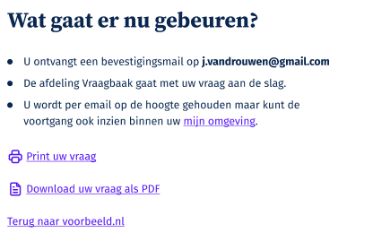

 Tot slot dient de gemeente bewijslast te hebben, dat betekent dat een systeem moet zijn waarin gegevens gelogd worden.

**Blok 2 - Uitgaande formele berichten:**\
Dit blok is niet verder onderverdeeld in fasen. Bij dit blok geld dat de Wmebv regelt dat als er genotificeerd wordt, dat er met een aantal zaken rekening gehouden moeten worden, namelijk:

- de afzender moet worden vermeld
- de aard van het bericht moet worden vermeld (Bijv. ontvangstbevestiging, beschikking, betalingsverplichting etc.)
- en een reactietermijn
- Indien een bericht of notificatie niet bezorgd kan worden (een bounce) dan moet het minimaal eenmaal opnieuw verzonden worden.
- De gemeente heeft een inspanningsverplichting om het juiste e-mailadres te achterhalen
- Notificaties moeten op andere wijze verzonden kunnen worden

In het volgende hoofdstuk wordt nog iets dieper ingegaan op notificaties.\
_**Wmebv-ontwerpadvies:**\
Denk bij het ontwerpen van deze communicatie aan de hierboven genoemde punten Voor meer gedetailleerde informatie over notificaties wordt verwezen naar [de bijdrage over notificatie en Wmebv door Logius.](https://www.logius.nl/domeinen/interactie/mijnoverheid/wet-modernisering-elektronisch-bestuurlijk-verkeer) Waar onder andere toelichting gegeven wordt op de nieuwe notificatie templates die door hen ontwikkeld zijn het meest recente UX onderzoek naar communicatie templates vond plaats in oktober 2023, de resultaten zullen naar verwachting spoedig beschikbaar zijn. Ook worden nieuwe technische mogelijkheden zoals een nieuwe variabele voor een 'einddatum handelingstermijn' in meer detail besproken._\

De gemeente heeft tevens een bewijslast en moet het volgende kunnen bewijzen:

- Het tijdstip van verzending of ontvangst
- De verzending met de samenhangende ontvangstbevestiging of notificatie
- Tijdstip inlog geadresseerde om kennis te nemen van een aan hem gezonden bericht
- Ontvangen meldingen van formele berichten die niet konden worden bezorgd

Voor meer verdieping in de juridische aspecten wordt verwezen naar de video-opname van Kennissessie 1:  Juridisch Aspecten genoemd in paragraaf [4.2](#42-wat-zijn-formele-berichten)

**Blok 3 - Zorgplicht:**\
Tot slot staat  in het schema de zorgplicht genoemd.
De Wmebv regelt tevens een zorgplicht voor passende ondersteuning bij communicatie.
Denk hierbij aan:

- Passende ondersteuning is afgestemd op de doelgroepen en hun vaardigheden (lezen, schrijven, omgaan met digitale apparaten)
- Passende ondersteuning is generiek (zoals informatie op een website) en persoonlijk (zoals hulp aan de telefoon of balie)
- Bij Passende ondersteuning is maatwerk niet verplicht
- Beleid over passende ondersteuning opstellen en publiceren op de website (bijvoorbeeld regels of een (uiteraard toegankelijke) handreiking)

Voor een uitgebreide toelichting op de Zorgplicht wordt verwezen naar de video-opname van 11 oktober 2023, [Kennissessie 3: Zorgplicht](https://vng.nl/wmebv-webinars-en-kennissessies)

# 5. Theorie: Ontwerpcriteria voor het ontwerpen en toetsen van e-formulieren en notificaties

Bij het toetsen van formulieren en notificaties Wmebv is het van belang om te zorgen dat deze voldoen aan de eisen van de wet, met een focus op digitale toegankelijkheid en gebruiksvriendelijkheid. Hier zijn enkele specifieke punten waaraan aandacht besteed zou moeten worden:

## 5.1. Digitale Toegankelijkheid en Gebruikersvriendelijkheid

Zorg ervoor dat formulieren en notificaties voldoen aan de richtlijnen voor [digitale toegankelijkheid](https://digitaaltoegankelijk.nl/over-digitale-toegankelijkheid/?gad_source=1&gclid=CjwKCAiAu9yqBhBmEiwAHTx5pwysW_wLxGEtgB5WBIudRJTs5oxdsWq63pcDaPVHx0wiFQwHvbKfQRoCnssQAvD_BwE), zoals vastgesteld in de [Web Content Accessibility Guidelines (WCAG)](https://www.w3.org/WAI/standards-guidelines/wcag/). De meest voor de hand liggende punten om rekening mee te houden:

- De **structuur** van het formulier zowel in de frontend als de backend moet goed in elkaar zitten, vermijd hierbij, indien mogelijk, een horizontale layout. Voorzie alle inputvelden van een label en stapel de velden bijvoorbeeld:
  
  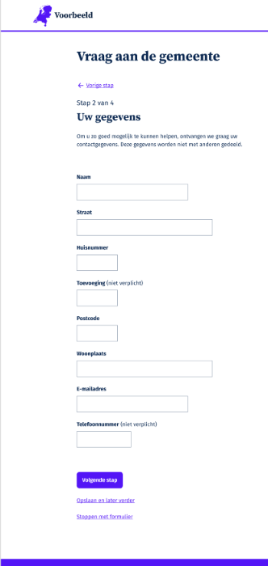\
  **_Advies onderzoeksvraag:_**\
  _Wordt het formulier met een screen reader in de juiste volgorde voorgelezen?_
  

- Maak **foutmeldingen** visueel en tekstueel duidelijk. Leid de gebruiker naar de plek waar de fout opgelost moet worden
  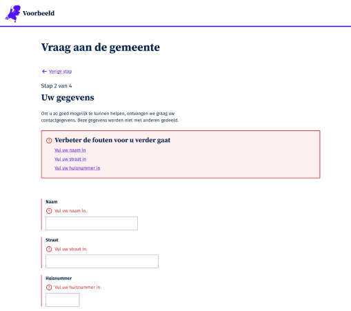
  
  **_Advies onderzoeksvraag:_**\
  _Kunnen gebruikers met diverse niveaus van geletterdheid en visueel, auditieve en fysieke beperkingen, zonder in de stress te raken, de fouten in het formulier vinden en oplossen?_

- Zorg ervoor dat formulieren met het toetsenbord bediend kunnen worden.
- Houdt rekening met tijdslimieten waarin een formulier ingevuld moet worden, niet iedereen kan dit in een vergelijkbaar tempo.
  
  **_Advies onderzoeksvraag:_**\
   _Kunnen gebruikers met diverse niveaus van geletterdheid en visueel, auditieve en fysieke beperkingen, zonder muis en met een toetsenbord eenvoudig door het formulier navigeren binnen een eventueel gestelde tijd?_

- Vertrouw niet alleen op kleur en zorg voor leesbare [tekst op B1 niveau](https://ishetb1.nl/) en [test het formulier en de website op het kleurcontrast](https://www.toptal.com/designers/colorfilter) in verband met de vele vormen en gradaties van kleurenblindheid.\
\
Bron: [https://www.toptal.com](https://www.toptal.com)

Naast toegankelijk formulieren is het ook belangrijk de eventuele bijlagen in de vorm van documenten digitaal toegankelijk te maken. Zoals digitaal toegankelijke pdf's of afbeeldingen die voor mensen die blind of slechtziend is niet te ontcijferen zijn.

- Overweeg om in plaats van pdf's, toegankelijke HTML te gebruiken indien de inhoud enkel bekeken dient te worden
- Overweeg om [OpenDocument](https://opendocumentformat.org/guidance/accessibility/) te gebruiken voor pdf-formulieren die aanpasbaar moeten zijn.
- Als er toch pdf gebruikt moet worden, zorg ervoor dat [Pdf's zo digitaal toegankelijk mogelijk](https://accessible-pdf.info/en/basics/) zijn en overweeg dan een digitaal toegankelijke versie van de inhoud, in bijvoorbeeld HTML, ernaast aan te bieden.
- Onthoudt dat het makkelijker is om digitaal toegankelijke HTML of OpenDocument te maken dan een digitaal toegankelijke pdf.
  
Zorg ervoor dat de taal eenvoudig en duidelijk is en dat gebruikers gemakkelijk door het formulier of de notificatie kunnen navigeren. Voor meer informatie wordt verwezen naar [de aanbevolen richtlijnen voor taalgebruik](https://www.communicatierijk.nl/vakkennis/rijkswebsites/aanbevolen-richtlijnen/taalniveau-b1) van Dienst Publiek en Communicatie van het Ministerie van Algemene Zaken.

- Vul invulvelden waar mogelijk vooraf in
- Geef voorwaarden, uitleg, benodigde informatie, documenten aan
- Gebruik duidelijke taal en begrippen
- Licht vragen en termen toe, waar nodig
- Test de formulieren en notificaties op algemene gebruiksvriendelijkheid. Zijn ze intuïtief en gemakkelijk te begrijpen voor de gebruiker?

## 5.2. Rechtsgeldigheid en Authenticatie

Controleer of de gebruikte elektronische handtekeningen en authenticatiemethoden voldoen aan de [wettelijke vereisten voor rechtsgeldigheid](https://www.rijksoverheid.nl/onderwerpen/digitale-overheid/digitale-veiligheid-en-identiteit). Zorg ervoor dat er passende maatregelen zijn genomen om de identiteit van de gebruiker te verifiëren.

## 5.3. Privacybescherming

Wees alert op privacykwesties bij het verzamelen en verwerken van persoonsgegevens. Zorg ervoor dat de formulieren en notificaties voldoen aan de Algemene Verordening Gegevensbescherming (AVG) en andere relevante privacywetgeving. Raadpleeg hiervoor de [uitgebreide informatie over privacybescherming](https://www.rijksoverheid.nl/onderwerpen/privacy-en-persoonsgegevens)  op de website van de Rijksoverheid.

## 5.4. Veiligheid

Controleer of er voldoende [beveiligingsmaatregelen](https://www.cip-overheid.nl/) zijn genomen, met name bij het verzenden van gevoelige informatie. Beveiligde verbindingen (HTTPS) en versleuteling van gegevens zijn hierbij belangrijk.

## 5.5. Aanpasbaarheid en Responsiviteit

Zorg ervoor dat formulieren en notificaties goed werken op verschillende apparaten en schermformaten. Zorg ervoor dat de formulieren ook goed werken op mobiele apparaten zoals telefoons en tablets. Houdt hierbij extra rekening met dat het [juiste mobile toetsenbord](https://www.mobilespoon.net/2018/12/10-usability-rules-keyboard-mobile-app.html) wordt aangeboden bij de bijbehorende velden. Qwerty bij tekstvelden, nummerriek bij nummervelden etc. Uit het recent uitgevoerde usability onderzoek dat verderop in dit document wordt toegelicht, kwam naar voren dat het merendeel van de participanten gebruikmaken van hun mobile telefoon of tablet om dergelijke formulieren in te vullen. Daarbij zijn ze vaak geholpen met de woordsuggesties die het mobile apparaat toont, om zo sneller een tekst te kunnen produceren.\
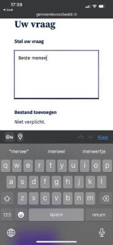\
Responsiviteit of adaptiviteit is essentieel voor een goede gebruikerservaring op zowel desktops als mobiele apparaten. [Een interessant artikel over het verschil tussen Responsive en Adaptive ontwerp.](https://www.uxpin.com/studio/blog/responsive-vs-adaptive-design-whats-best-choice-designers/)

## 5.6. Duidelijke Instructies en Hulpfuncties

Bied duidelijke instructies bij het invullen van formulieren en zorg voor eventuele hulpfuncties indien nodig. Gebruikers moeten gemakkelijk de benodigde informatie kunnen vinden en begrijpen hoe ze het formulier moeten invullen. Nielsen Norman Group schreef een [helder artikel over Help en Documentation.](https://www.nngroup.com/articles/help-and-documentation/)

## 5.7. Notificatie-Inhoud en Timing

Bij notificaties is het belangrijk dat de inhoud relevant, begrijpelijk en tijdig is. Vermijd overbodige informatie en zorg ervoor dat de notificatie op het juiste moment wordt verstuurd. Hierbij geldt voor de Wmebv dat de notificatie binnen 48 uur na plaatsing van het formele bericht in het systeem voor gegevensverwerking aan de geadresseerde van het bericht worden gestuurd en dat de inhoud aan een aantal eisen moet voldoen, zoals:

- De aard en rechtsgevolg van de boodschap moet vermeld worden.
- Er moet duidelijk vermeld worden dat er een reactie van de geadresseerde verwacht wordt (bijvoorbeeld: betalen, informatie verstrekken).
- Wanneer een bericht een termijn bevat waarbinnen de geadresseerde moet reageren, moet deze termijn ook vermeld worden in de notificatie.

Dit en meer is uitgebreid terug te lezen is in de [bijdrage over notificaties en de Wmebv](https://www.logius.nl/domeinen/interactie/mijnoverheid/wet-modernisering-elektronisch-bestuurlijk-verkeer) van Logius.

## 5.8. Testen met Gebruikers

Voer usability-tests uit met gebruikers om inzicht te krijgen in hun ervaring en eventuele pijnpunten te identificeren. Dit kan helpen bij het verbeteren van de algehele gebruikerservaring. Goed om te weten is dat [al met vijf participanten](https://www.nngroup.com/articles/how-many-test-users/) al een groot deel van de pijnpunten aan het licht komen. Het is aan te raden gebruik te maken van instanties die gespecialiseerd zijn in het uitvoeren van Usability tests, zoals [Stichting Accessibility](https://www.accessibility.nl/) of [Valsplat](https://valsplat.nl/).

## 5.9. Ontwerpcriteria samengevat

In de paragraaf hiervoor is uitgebreid stilgestaan bij ontwerpcriteria voor e-formulieren en notificaties waarmee in het algemeen en Wmebv specifiek rekening gehouden moet worden. Hieronder worden de punten voor het gemak nog even op een rijtje gezet. een praktische lijst met ontwerpcriteria waarmee rekening gehouden dient te worden tijdens het ontwerp van e-formulieren en notificaties.

**Algemene e-formulier ontwerpcriteria:**

Let op, de **vetgedrukte** een met (**\*\***) gemarkeerde punten zijn ook van toepassing op de Wmebv.

1. Vul invulvelden waar mogelijk vooraf in
2. Geef voorwaarden, uitleg, benodigde informatie, documenten aan
3. **Gebruik duidelijke en eenvoudige taal en begrippen \*\***
4. Licht vragen en termen toe, waar nodig
5. Zorg voor toegankelijke bijlagen zoals toegankelijke pdf's of HTML.
6. **Vraag alleen noodzakelijke gegevens en informatie \*\***
7. Geef aan welke vragen/velden verplicht zijn
8. Geef foutmeldingen duidelijk en gebruikersvriendelijk aan
9. Geef processtap in formulier aan tijdens het invulproces
10. Ondersteun de bezoeker bij het invullen en afronden, door duidelijke knoppen
11. Zorg voor tussentijdse opslag van informatie

**AVG-regels waar rekening mee moet worden gehouden:**

1. Wees transparant
2. **Verzamel zo min mogelijk persoonsgegevens \*\***
3. Vraag toestemming
4. Gebruik eenvoudige taal
5. **Verzend e-formulieren over versleutelde verbindingen \*\***
6. **Registreer verwerking in verwerkingsregister \*\***

**Wmebv e-formulier ontwerpcriteria:**\
Naast de de met (\*\*) gemarkeerd punten zijn er nog twee punten die in het achterhoofd gehouden moeten worden. Op zich zijn onderstaande punten niet perse e-formulier ontwerpcriteria, echter moet er wel rekening mee gehouden worden tijdens het ontwerp van de communicatiestroom waar het e-formulier of notificatie onderdeel vanuit maakt.

1. Toon of verstuur (indien mogelijk) een ontvangstbevestiging
2. Maak ingevulde gegevens toegankelijk voor de indiener.

Deze lijst is onder andere geput uit de door de VNG aangeboden [Toolkit Meten en Verbeteren van Webformulieren.](https://vng.nl/kennisbank-dienstverlening-gemeenten/toolkit-meten-en-verbeteren-van-webformulieren) het [A11Y project](https://www.a11yproject.com/posts/how-to-write-accessible-forms/) en het [World Wide Web Consortium (W3C)](https://www.w3.org/WAI/standards-guidelines/wcag/).

Voor meer gedetailleerde informatie over notificaties wordt verwezen naar [de bijdrage over notificatie en Wmebv door Logius.](https://www.logius.nl/domeinen/interactie/mijnoverheid/wet-modernisering-elektronisch-bestuurlijk-verkeer) Waar onder andere toelichting gegeven wordt op de nieuwe notificatie templates die door hen ontwikkeld zijn en nieuwe technische mogelijkheden zoals een nieuwe variabele voor een 'einddatum handelingstermijn'.

# 6. Praktijk: Ontwikkeling van generiek e-formulier op basis van NL Design System

## 6.1. Project achtergrond en doelstelling

Om een praktisch voorbeeld te kunnen geven van een generiek e-formulier is er samengewerkt met NL Design System om binnen een relatief korte tijd te kunnen komen tot een generiek formulier waar niet alleen code van de gebruikte NL Design System componenten beschikbaar wordt gesteld maar ook inzage geeft in het ontwerpproces en de bouw met behulp van NL Design System componenten. Er is gekozen voor het generieke formulier "Vraag aan uw gemeente", omdat dit het meest laagdrempelige formulier is wat wellicht initieel ingezet kan worden om een digitaal kanaal open te kunnen zetten voor met name die processen die nog niet over een (specifiek) formulier beschikken, maar die wel gecategoriseerd zijn als processen waar het berichtenverkeer geldt als formeel bericht. Het "Vraag uw gemeente"-formulier kan als initieel digitale contactformulier gebruikt worden, indien er onvoldoende tijd is voordat de Wmebv van kracht gaat om een goed, veilig, Digitaal toegankelijk en Wmebv-proof specifiek formulier voor bepaalde producten te kunnen ontwikkelen. Let wel, dat de behandeling van een degelijk generiek formulier omslachtiger zal zijn dan wanneer er gebruik gemaakt zou worden van een bijvoorbeeld een specifiek formulier in combinatie met een achterliggend zaaksysteem, denk hierbij aan de [Omnichannel kanaalstrategie](https://vng.nl/omnichannel) en de bijbehorende kennissessie van 10 oktober 2023: [Video - Kennissessie 2: Omnichannel](https://vng.nl/wmebv-webinars-en-kennissessies)

## 6.2. NL Design System

[NL Design System](https://nldesignsystem.nl/) is een methodiek van samenwerken. NL Design System is een community van ontwerpers en ontwikkelaars met allerlei expertise, van UX-, UI-, toegankelijkheidsexperts tot programmeurs, die samenwerken aan de totstandkoming van een grote verzameling [Open Source](https://opensource.org/definition-annotated/) componenten, denk aan bijvoorbeeld een button, een invoerveld of een combinatie van componenten die een hele header vormen. Deze componenten worden voorzien van een consistente huisstijl en richtlijnen. Denk bijvoorbeeld aan richtlijnen voor het ontwerpen van e-formulieren of een hele MijnOmgeving met componenten van NL Design system of het schrijven van toegankelijke teksten. Het werken met en aan componenten van NL Design System resulteert in een steeds grote groeiende bibliotheek van digitaal toegankelijke componenten waaruit geput kan worden bij het ontwerpen en ontwikkelen van digitale overheidsproducten zoals websites en e-formulieren.

>Samen maken we de digitale dienstverlening van de overheid toegankelijk, inclusief en gebruiksvriendelijk.
>
>Een design system lijkt op basis van de naam vooral over ontwerp te gaan, maar het is eigenlijk een brede aanpak om makkelijker consistente, toegankelijke en gebruiksvriendelijke websites en applicaties te maken.
>
>Dat doet het kernteam niet alleen, maar samen met ontwerpers, ontwikkelaars, content schrijvers en andere experts uit verschillende organisaties.
>
>- Gebouwd en gebruikt door de community
>- Platform en huisstijl onafhankelijk
>- Uitbreidbaar en publiek beschikbaar

Bron: website NL Design System

### 6.2.1. Design Tokens

Om de NL Design System componenten te voorzien van huisstijl wordt gebruik gemaakt 'thema's' waarin de ontwerpkeuzes voor de honderden NL Design Tokens staan. Uiteraard hoeven niet alle honderden aangepast te worden, maar het geeft de mate van flexibiliteit aan. Zo zijn er design tokens voor de verschillende lettertypes, kleuren van knoppen, randjes van knoppen, border-radius van knoppen en nog veel meer. Met een thema zijn de componenten dus te voorzien van hun eigen stijl, zodat deze aansluit op de huisstijl van de organisatie en zonder afbreuk te doen aan de digitaal toegankelijke werking ervan, mits uiteraard gehouden wordt aan de richtlijnen, denk bijvoorbeeld aan kleurcontrast, waarover werd toegelicht in paragraaf [5.1](#51-digitale-toegankelijkheid-en-gebruikersvriendelijkheid). Om nog iets dieper in te gaan op de samenwerking tussen ontwerpers en ontwikkelaars is het interessant om te weten dat met behulp van de design tool genaamd Figma in combinatie met de Token Studio plugin er een naadloze samenwerking ontstaat tussen het ontwerpen in Figma en de daadwerkelijke styling van de geprogrammeerde schermen. Waar vroeger een stijlgids overgenomen moest worden door frontend developers, kan de ontwerper nu zelf styling aandragen en updaten rechtstreeks vanuit Figma. Voor meer over deze magie wordt verwezen naar een interessante [video presentatie over design tokens](https://youtu.be/n9m2TtD1esE?si=oVwolw51XTtgmt28) tijdens het jaarlijkse [Design Systems Week](https://nldesignsystem.nl/events/design-systems-week-2023/en/overview/) en de [tekstuele toelichting op design tokens](https://nldesignsystem.nl/meedoen/design-tokens/) op NL Design System. Tot slot is het interessant om te zien hoe verschillende gemeenten al hun eigen thema's beginnen op te bouwen en bijhouden in het [NL Design System Storybook](https://nl-design-system.github.io/themes/?path=/story/blockquote--gemeente-utrecht).
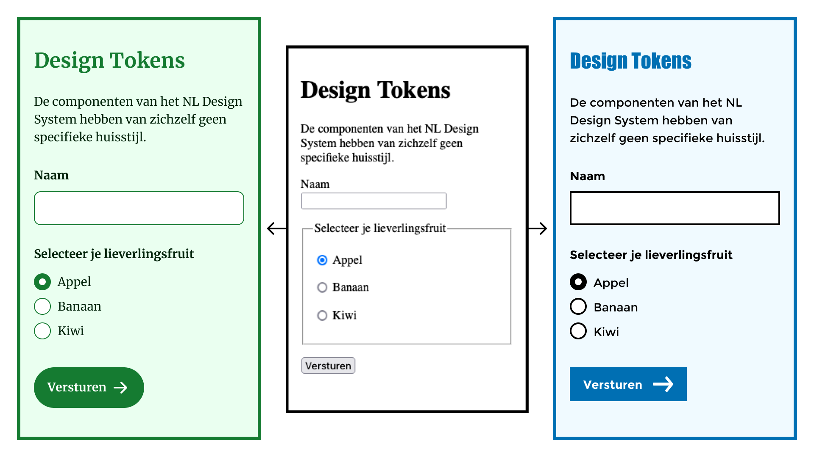\
Bron: website NL Design System

### 6.2.2. Het Estafette model

De NL Design System richtlijnen, patronen en componenten (vanaf nu: 'onderdelen') ontstaan vanuit de community. Als deze onderdelen worden ontworpen en ontwikkeld, bewegen ze zich door het zogenaamde ['Estafettemodel'](https://nldesignsystem.nl/meedoen/estafettemodel). Onderdelen worden tijdens hun estafettereis door de community aangedragen, ontworpen en ontwikkeld volgens de NL Design System richtlijnen om uiteindelijk de Hall of Fame status te kunnen bereiken, wat inhoud dat een onderdeel voldoet aan de Definition of Done van NL Design System. \
Onderdelen worden tijdens hun Estafettereis Open Source gedeeld met iedereen in de community. Op [Slack (een berichten applicatie voor communities)](https://slack.com/) en tijdens de wekelijks [Design Open Hour](https://nldesignsystem.nl/meedoen/als-designer/community/) en twee wekelijke [Heartbeat sessies](https://nldesignsystem.nl/project/blijf-op-de-hoogte) wordt iedereen uitgenodigd ontwerpenvraagstukken aan te dragen, ontwerpen te presenteren en/of feedback te geven. Op deze manier leert de community van elkaar en worden de componenten steeds eenduidiger verder doorontwikkeld, wat uiteindelijk resulteert in steeds groter groeiende bibliotheek van onderdelen die door iedereen gebruikt kunnen worden en wat leidt tot een eenduidig en consistente User Experience van overheidsproducten. Een mooi voorbeeld is het [GOV.UK Design System van het Verenigd Koninkrijk](https://design-system.service.gov.uk/).

## 6.3. Globaal: Aanpak ontwikkeling generiek e-formulier

### 6.3.1. Samenwerking

Voor het ontwerp en de ontwikkeling van het generieke e-formulier is er nauw samengewerkt met UX designers, accessibility experts en developers vanuit het NL Design System kernteam en UX designers uit de NL Design system community. Met name een UX Designer van gemeente Den Haag, die al veel ervaring heeft met het ontwerpen in [Figma](https://www.figma.com/design/) op basis van NL Design System en ook veel [onderzoek heeft gedaan naar gebruikersvriendelijkheid van generieke services](https://vng.nl/artikelen/ux-onderzoek-generieke-services) binnen de MijnOmgeving. Er heeft ten tijde van het ontwerp een grote ontwerpworkshop plaatsgevonden in de NL Design System community waarin onder andere over ontwerppatronen, styling en tekst collectieve besluiten zijn genomen. Deze besluiten zijn doorgevoerd in de schermontwerpen om deze mee te kunnen nemen in de usability test. Tevens is het ontwerp onder ander gedeeld tijdens de de [Heartbeat sessie van 31 oktober 2023](https://nldesignsystem.nl/events/heartbeat/#heartbeat) van NL Design System en een e-formulieren sessie van Gebruikers Centraal.
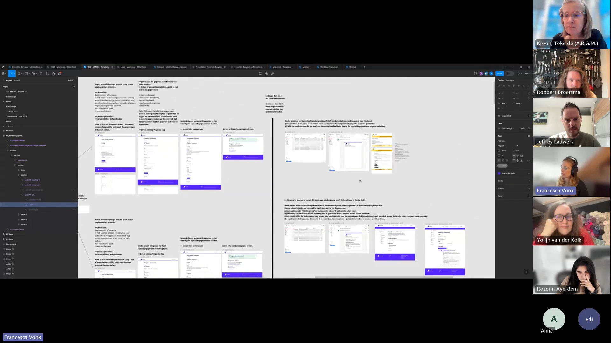

### 6.3.2. Voorbereiding

Ter voorbereiding is initieel gestart met deskresearch door de ontwerper. Er zijn ontwerpcriteria verzameld en er is specifiek gekeken naar de impact van de Wmebv op deze ontwerpcriteria. Deze ontwerpcriteria zijn in [hoofdstuk 5](#5-theorie-ontwerpcriteria-voor-het-ontwerpen-en-toetsen-van-e-formulieren-en-notificaties) besproken.

Vervolgens is er onderzoek gedaan om te komen tot een prototype in Figma op basis van NL Design System. Er is besloten om het "Vraag aan uw gemeente" e-formulier inclusief de user journey wat hoort bij dit e-formulier van Gemeente Den Haag te nemen als uitgangspunt voor het generieke e-formulier, omdat dit formulier eveneens genoemd wordt in de bijlage (pagina 72 in de footnote) over Generieke e-formulieren van het rapport over de [Implementatiepilot Wet modernisering elektronisch bestuurlijk verkeer (Wmebv)](https://vng.nl/brieven/verslag-pilots-wetsvoorstel-wet-modernisering-elektronisch-bestuurlijk-verkeer-wmebv).

### 6.3.3. Ontwerp

#### 6.3.3.1. Scenario

Om de use case van dit generieke formulier te ondersteunen en te kunnen testen is nagedacht over een scenario waarin dit formulier gebruikt zou kunnen worden. Om het scenario aan te laten sluiten bij op de Wmebv, is in overleg met een jurist gekomen tot een situatie waarbij de fictieve burger (een persona) Jeroen van Drouwen de gemeente waarin hij woonachtig is (Gemeente Voorbeeld) in gebreken stelt. Het in gebreken stellen heeft een juridisch gevolg, dus valt deze 'vraag aan de gemeente'in de categorie 'Formele berichten' en is de Wmebv dus van toepassing.

#### 6.3.3.2. User Journey

Om te komen tot een prototype schermflow, is een user journey uitgewerkt en uitgebreid besproken in de NL Design System community.De bijbehorende Figma schermen can deze user journey worden in de volgende paragraaf getoond en zijn eveneens beschikbaar in de [VNG Wmebv Figma omgeving](https://www.figma.com/file/iIr1gkAR3oZ0UFWKIni8Nv/VNG---WMEBV---Templates?type=design&node-id=315%3A89&mode=design&t=OlU3fZjF6snJQaPk-1), waar een gratis Figma account voor aangemaakt moet te worden.

\
Afbeelding: Schematische weergave van de user journey.

A.\
Jeroen van Drouwen heeft een 8 weken geleden een Bijstandsuitkering aangevraagd en nog geen reactie gehad van de Gemeente.Jeroen vindt dit niet leuk en denkt dat de gemeente inmiddels al te laat is met reageren en besluit een vraag aan de gemeente hierover te willen stellen.Jeroen komt via de Homepage van Gemeente Voorbeeld op de Contactpagina uit.
Hier kan hij kiezen wat hij wil doen. Jeroen besluit een Vraag te willen stellen en start het Contactformulier.

B.\
Jeroen Komt op de intro-pagina van het ‘Vraag aan de gemeente’-formulier uit.Daar kan hij een aantal punten lezen. Hoelang het formulier ongeveer duurt, dat hij verplichte en optionele velden kan aantreffen, dat hij het tussentijds kan opslaan en later verder gaan en dat er een bevestiging-email gestuurd gaat worden. Tot slot kan hij lezen dat het ingevulde formulier gedownload en geprint kan worden.Jeroen klikt op Doorgaan

C.\
Vervolgens moet Jeroen een keuze maken. Wil hij inloggen of niet. Beide paden worden ondersteund in het ontwerp en in de uiteindelijke ontwikkeling. Echter, zal er het DigiD-gedeelte worden overgeslagen omdat dit buiten de scope van dit project ligt.

D.\
Indien Jeroen ervoor kiest om in te loggen, zal er een zeer eenvoudig scherm verschijnen met "Doe alsof u inlogt met DigiD" om zo tijdens de usability test zeer duidelijk te maken dat er niet werkelijk wordt ingelogd met DigiD.

E stap 1/4.\
Nadat Jeroen al dan niet is ingelogd komt hij op de eerste pagina van het generieke e-formulier.\
Jeroen typt:\
_Beste meneer of mevrouw, Ik heb meer dan 8 weken geleden een aanvraag voor bijstandsuitkering gedaan maar ik heb nog steeds niets gehoord. Volgens mij had u allang op mijn aanvraag moeten beslissen.\ 
Met vriendelijke groet,Jeroen van Drouwen_\
Jeroen upload niets en Jeroen klikt op ‘Volgende stap’

E stap 2/4.\
Als Jeroen niet is ingelogd via DigiD, zijn al zijn gegevens nog niet vooringevuld. Als Jeroen wel is ingelogd zijn zijn gegevens wel voor ingevuld en hoeft hij ze enkel te controleren. Hij heeft geen optie om zijn gegevens te kunnen wijzigen behalve voor zijn telefoonnummer en e-mailadres. Jeroen vult zijn gegevens in, indien mogelijk met behulp van de Autocomplete functie van de computer.\
_Jeroen van Drouwen\
Laan der voorbeelden 99\
1024 VP Voorbeeld\
j.vandrouwen@EenNepEmailAdres.com\
06006118346\
Jeroen klikt op 'Volgende stap'

Note: Tijdens de Usability test vragen we de mensen hun eigen autocomplete te gebruiken en leggen we uit dat we in dit scenario doen alsof Jeroen zijn gegevens dan worden ingevuld. Ook benadrukken we dat hun gegevens niet worden opgeslagen.

E stap 3/4.\
Controleer de ingevulde gegevens en verzend het formulier (E 4/4).\
Na het verzenden zou je een e-mailnotificatie moeten ontvangen waarin wordt bevestigd dat de gemeente jouw vragen en opmerkingen heeft ontvangen. Bekijk de e-mail en vertel ons wat je ervan vindt.

E stap  4/4.\
Op dit scherm staat groot 'Uw vraag is met succes verstuurd'. Het In het scenario waarin Jeroen niet inlogt, wordt er op dit scherm een opsomming gegeven waarin staat dat er een bevestigingsmail naar Jeroen zijn e-mailadres gestuurd is en dat afdeling 'Vraagbaak'met de vraag aan de slag gaat. In het scenario waarin Jeroen wel gaat inloggen staat er als extra punt bij dat hij de voortgang in de MijnOmgeving kan volgen.

Vervolg het scenario buiten de Gemeente Voorbeeld omgeving:\
Deze laatste taken zijn tijdens de usability test met behulp van Gmail en Figma uitgevoerd. In het kader van de tijd was het niet mogelijk een MijnOmgeving in code klaar te zetten, daarom is er gebruik gemaakt van een Figma scherm, die niet met een screen reader of anderszins op accessibility getest kan worden. Tijdens de Usability tests zijn deze schermen voorgelegd en toegelicht door de onderzoeker om op die manier nog waardevolle feedback te kunnen ontvangen.

Gmail.\
In het korte scenario, waarin Jeroen niet via DigiD inlogt opent hij Gmail en ziet daar de ontvangstbevestiging staan met een digitaal toegankelijke, met Markdown gegenereerde pdf met zijn ingevulde vraag en contactgegevens. Indien er via de ingelogde route is gegaan, dan luidt het scenario dat er binnen 48 uur een reactie is binnen gekomen via Gmail. Jeroen van Drouwen open zijn email en ziet een mailtje van gemeente Voorbeeld staan waarin aangegeven wordt dat hij via zijn MijnOmgeving de reactie van de gemeente kan inzien.

MijnOmgeving.\
In de MijnOmgeving beland Jeroen op het overzicht-scherm kan hij kan via 'Mijn zaken', de reactie van de gemeente op zijn vraag vinden.

#### 6.3.3.3. Tooling

Voor het ontwerp van de schermen is gebruik gemaakt van de design tool [Figma](https://www.figma.com/design/). In de volgende paragraaf worden de Figma schermen getoond. Deze schermen kunnen ook in de [VNG Wmebv Figma omgeving](https://www.figma.com/file/iIr1gkAR3oZ0UFWKIni8Nv/VNG---WMEBV---Templates?type=design&node-id=315%3A89&mode=design&t=OlU3fZjF6snJQaPk-1) bekeken worden, hiervoor dient echter een gratis Figma account aangemaakt te worden.

Voor het ontwerp is gebruik gemaakt van de NL Design System 'Voorbeeld'-bibliotheek met het paars-witte 'Voorbeeld'-thema voor Figma. Met behulp van deze bibliotheek kon er in relatief korte tijd een schermflow gebouwd worden. Het scheelt enorm veel tijd als er gebruik gemaakt wordt van de Voorbeeld-bibliotheek omdat het opzetten van een bibliotheek al is gedaan. Stel dat er voor een ander thema van de Voorbeeld-thema gekozen zou worden dan hoeven enkel de [design tokens](#621-design-tokens) voorzien te worden van het eigen thema. Voor meer informatie over hoe dit in zijn werk gaat binnen Figma wordt verwezen naar de [pagina voor designers met NL Design System](https://nldesignsystem.nl/meedoen/als-designer/overzicht).

### 6.3.4. Ontwikkeling

<mark>
- (vragen aan Mees/Robbert/Yolijn)
- houd de NLDS site in de gaten voor code snippets
Voor meer informatie over hoe dit in zijn werk gaat voor developers wordt verwezen naar de [pagina voor developers met NL Design System](https://nldesignsystem.nl/meedoen/als-developer/overzicht).
Bekijk de [live demo van de geprogrammeerde schermen](https://www.gemeentevoorbeeld.nl/wmebv).
</mark>

### 6.3.5. Testen met gebruikers

<mark>
8 participanten
- 6 laaggeletterd
- 1 fysiek beperkt
- 1 visueel beperkt
2 onderzoeksdagen
Onderzoek:
- pre-interview
  - specifieke taakopdrachten en vragen
- post-interview
Stichting Accessibility + op locatie en online meekijken + mogelijkheid vragen via chat
-uitkomsten (To come na de usability tests)
- Rapport komt beschikbaar op gebruikersonderzoeken.nl
</mark>

## 6.4. Specifiek: Uitwerking generiek e-formulier

### 6.4.1. Figma ontwerpen en Wmebv-ontwerpadviezen

De volgende schermen kunnen ook in de [VNG Wmebv Figma omgeving](https://www.figma.com/file/iIr1gkAR3oZ0UFWKIni8Nv/VNG---WMEBV---Templates?type=design&node-id=315%3A89&mode=design&t=OlU3fZjF6snJQaPk-1) bekeken worden, hiervoor dient echter een gratis Figma account aangemaakt te worden.
Bij elk scherm zijn de ontwerpadviezen aangegeven. Deze adviezen zijn voortgekomen uit het usability onderzoek dat heeft plaatsgevonden op 16 en 17 november 2023.

**Scherm A - Contact:** Een scherm met verschillende opties om contact te leggen met de gemeente.\
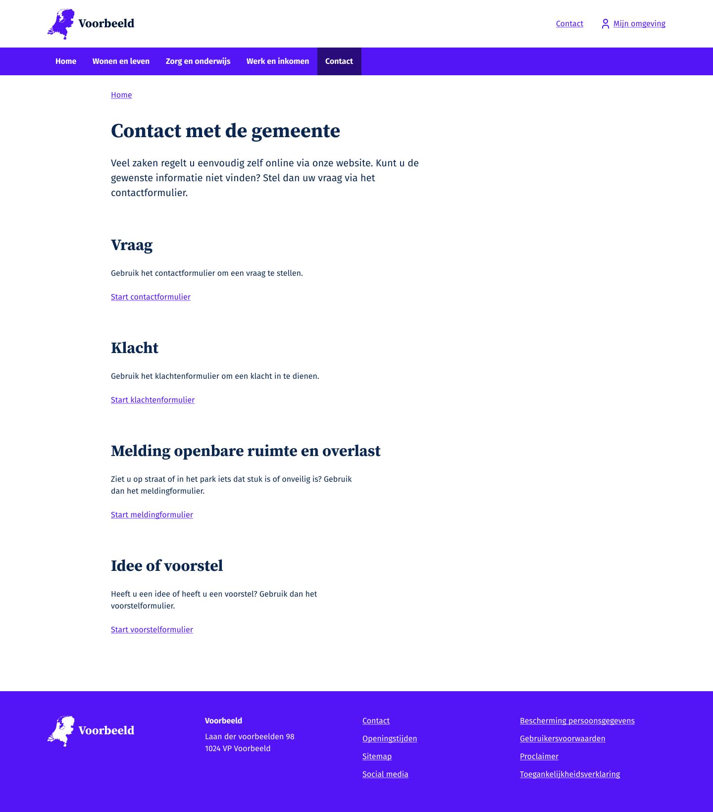\
_**Ontwerpadvies 1:** Dit scherm is onderverdeeld in een aantal verschillende onderwerpen: 'Vraag', 'Klacht','Melding openbare ruimte en overlast' en een 'Idee of voorstel'. Door te proberen de vraag in een vroeg stadium van de berichtenstroom te categoriseren als formeel of niet-formeel bericht, kunnen deze processen in een vroeg stadium herkend en behandeld worden met in acht name van de Wmebv. Er zijn overigens gemeenten die adviseren het onderscheid niet maken en alles behandelen als formeel bericht om zo ten alle tijden te voldoen aan de Wmebv. Gemeente Barneveld licht dit bijvoorbeeld toe in de [Kennissessie Juridische Aspecten van 9 oktober 2023](https://vng.nl/wmebv-webinars-en-kennissessies)._

**Scherm B - Uitleg over het formulier:** Een scherm met uitleg over wat de gebruiker te wachten staat, tijdens het invullen van het 'Vraag aan de gemeente' e-formulier.\
\
_**Ontwerpadvies en nader onderzoek 2:** Op dit scherm worden een aantal punten over wat de gebruiker kan verwachten toegelicht. In dit ontwerp staat dat het 'ongeveer 5 minuten zal duren' echter bleek uit het usability onderzoek dat deze hoeveelheid tijd niet voor iedereen geldt. Uit nader onderzoek moet blijken hoe de hoeveelheid werk, om het formulier in te vullen, inclusiever kan worden uitgedrukt._

_**Ontwerpadvies en nader onderzoek 3:** Op dit scherm wordt aan gegeven 'Vul alle velden in. Als een veld niet verplicht is, staat dit erbij.'. In dit ontwerp is gekozen voor de benadering van het GOV.UK Design System, waar bij [optionele velden gemarkeerd worden](https://design-system.service.gov.uk/patterns/question-pages/) hanteert waarbij gesteld wordt dat verplichte velden niet met een \* gemarkeerd moeten worden maar juist optionele velden gemarkeerd worden met 'Optional' wat wij in B1 vertaald hebben naar 'Niet verplicht'. Echter bleek uit de usability studie dat mensen dit niet duidelijk vonden en dat de  'Niet verplicht'gemarkeerde velden sneller overgeslagen werden, terwijl ze wel degelijk van belang kunnen zijn. Denk bijvoorbeeld aan een huistoevoeging. Iot nader onderzoek moet blijken of het markeren van verplichte velden niet toch een betere manier is. Het merendeel van de respondenten gaf aan het verwarrend te vinden._

**Scherm C - Inloggen:** Keuzescherm om in te loggen\
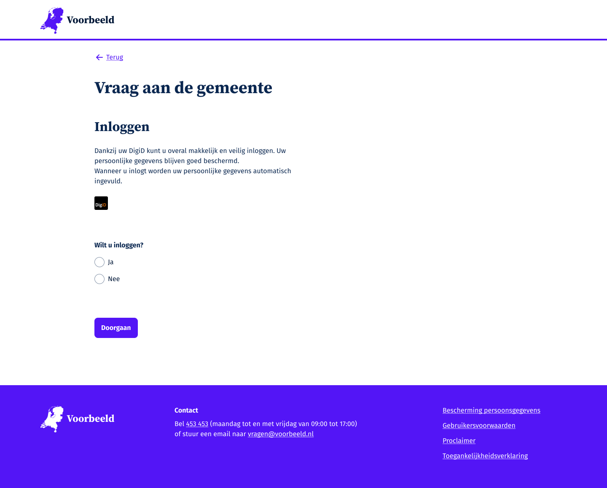\
_**Ontwerpadvies en nader onderzoek 4** Uit het usability onderzoek bleek dat sommige mensen het formulier hadden verwacht in plaats van een scherm met de mogelijkheid om in te loggen. Uit nader onderzoek moet blijken of dit inlogscherm op een andere plek in de user journey moet zitten of misschien op een andere visuele manier gepresenteerd moet worden. In dit ontwerp was gekozen voor radio buttons met ja en nee, maar misschien zijn mensen meer gebaat bij een andere weergave waarbij de voordelen van inloggen nog duidelijker benoemd staan. De voordelen staan in dit ontwerp maar merendeel van de participanten las de tekst niet omdat ze veel bezig waren met een keuze te maken om wel of niet in te loggen met 'het moeilijke 'of het 'enge' DigiD._

**Scherm E Formulier stap 1 (E 1/4):** Vraag aan de gemeente invoeren\
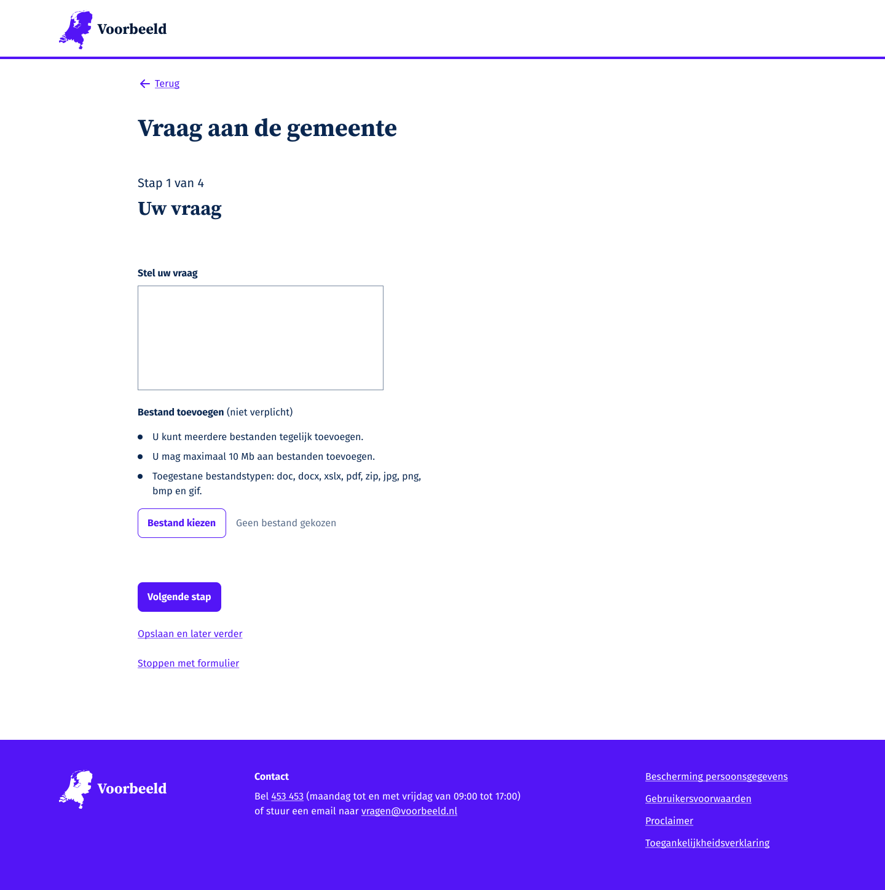\
_**Ontwerpadvies en nader onderzoek 5:** Uit het usability onderzoek kwam naar voren dat mensen veel hun mobiele apparaten gebruiken waarbij zij baat hebben van de suggestiewoorden die bij een mobieltoetsenbord getoond worden. Dit maakt het, vooral voor de laaggeletterde doelgroep, makkelijker om hun vraag goed te kunnen invoeren. Uit nader onderzoek moet blijken of er een invulhulp bedacht en aangeboden kan worden. Een vertaaloptie zou ook een meerwaarde kunnen bieden voor mensen die de Nederlandse taal niet voldoende beheersen.  Een ander idee zou kunnen zijn om mensen bij de scherm B te informeren dat zij dit formulier ook op een mobiel apparaat kunnen invullen en wat de voordelen daarvan zijn. Een nadeel daarvan zou zijn, dat zij niet bij documenten kunnen doe wellicht op hun computer staan._

**Formulier stap 2 (E 2/4):** Contactgegevens invoeren\
\
<mark>_**Ontwerpadvies 6:** ..._</mark>

**Formulier stap 3 (E 3/4):** Controleer gegevens en verzend\
\
<mark>_**Ontwerpadvies 7:** ..._</mark>

**Formulier stap 4 (E 3/4):** Uw vraag is met succes verstuurd\
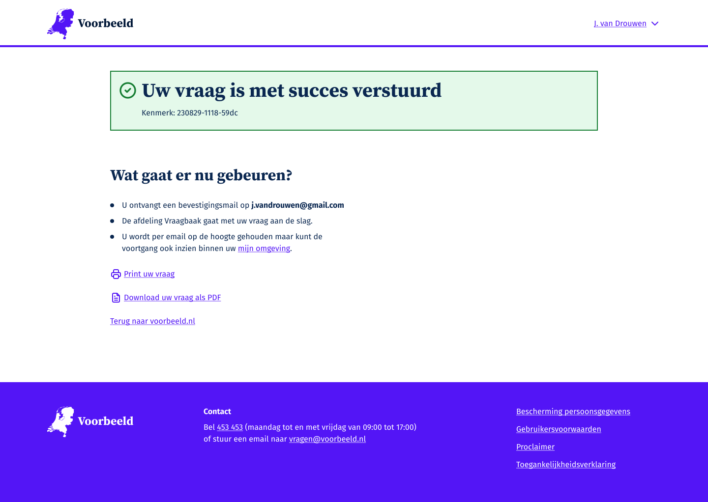\
<mark>_**Ontwerpadvies 8:** ..._</mark>

Figma schermen van de Gmail omgeving voor scenario E_kort:

**Gmail inbox (niet ingelogd scenario):** Ontvangstbevestiging in de Inbox\
\
<mark>_**Ontwerpadvies 9:** ..._</mark>

**Gmail berichtdetail (niet ingelogd scenario):** Ontvangstbevestiging inhoud emailtje\
\
<mark>_**Ontwerpadvies 10:** ..._</mark>

**Gmail PDF (niet ingelogd scenario):** Pdf met ingevulde gegevens\
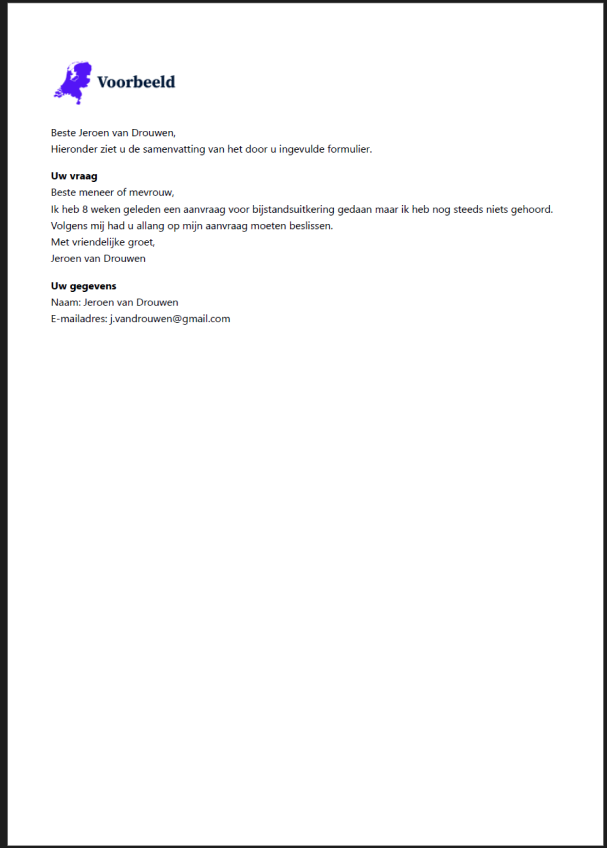\
<mark>_**Ontwerpadvies 11:** ..._</mark>

Figma schermen met een nagebooste Gmail omgeving voor scenario E_lang:

**Gmail inbox (wel ingelogd scenario)** Ontvangstbevestiging in de inbox\
\
<mark>_**Ontwerpadvies 12:** ..._</mark>

**Gmail berichtdetail (wel ingelogd scenario)** Een email met een een notificatie dat er een reactie van de gemeente in de MijnOmgeving staat.\
\
<mark>_**Ontwerpadvies 13:** ..._</mark>

**MijnOmgeving 0verzichtscherm** MijnOmgeving Overzicht-scherm waar een zaak klaarstaat.\
\
<mark>_**Ontwerpadvies 14:** ..._</mark>

**MijnOmgeving Mijn zaken** Overzicht van alle zaken, in dit geval maar een.\
\
<mark>_**Ontwerpadvies 15:** ..._</mark>

**MijnOmgeving zaakdetail** Scherm waarin de reactie van de gemeente te lezen is.\
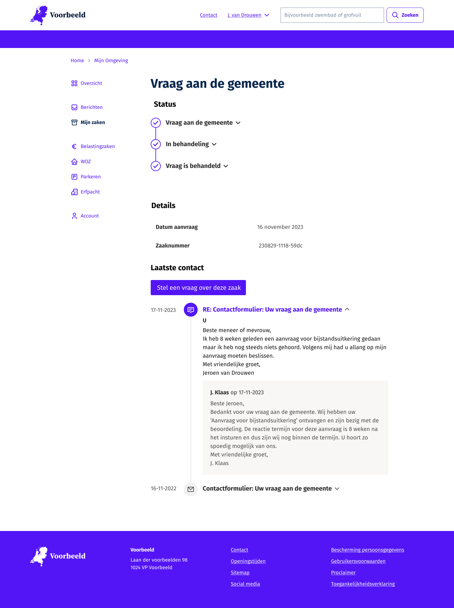\
<mark>_**Ontwerpadvies 16:** ..._</mark>

Bekijk de [uitgewerkte ontwerpen in detail in Figma.](https://www.figma.com/file/iIr1gkAR3oZ0UFWKIni8Nv/VNG---WMEBV---Templates?type=design&node-id=315%3A89&mode=design&t=OlU3fZjF6snJQaPk-1) en bekijk de [live demo van de geprogrammeerde schermen](https://www.gemeentevoorbeeld.nl/wmebv)

### 6.4.2. Development en Code Snippets

<mark>(To come op NL Design System website)</mark>

### 6.4.3. Usability Testresultaten 

<mark>(To come...)</mark>

# 7. Bronnen en overige informatie

## 7.1. Stappenplan implementatie Wmebv

Voor meer informatie over een mogelijke aanpak voor de implementatie van de Wmebv wordt verwezen naar dit [Stappenplan wet Wmebv](https://vng.nl/artikelen/stappenplan-wet-mebv) ter ondersteuning bij de implementatie van de Wmebv binnen uw organisatie, waarin de volgende onderwerpen behandeld worden:

**Digitalisering van de dienstverlening:**

1. Wat vraagt de Wmebv?
2. Hoe kan ik het aanpakken?
3. Slim digitaliseren met de [omnichannelaanpak](https://vng.nl/omnichannel).
4. Analyse huidige digitale kanalen met behulp van de [Uniforme Productnamen Lijst](https://vng.nl/projecten/uniforme-productnamen-lijst-upl)
5. Besluit en communiceer de gekozen kanalen.
6. Bepaal uw beleid t.a.v. een ([Omnichannel](https://vng.nl/omnichannel)) kanaalstrategie.
7. Aan de gang met implementeren.

Kijk voor meer informatie over de Omnichannel strategie naar de video-opname van 10 oktober 2023, [Kennissessie 2: Omnichannel](https://vng.nl/wmebv-webinars-en-kennissessies)

**Zorgplicht bij de dienstverlening:**

1. Bepaal welke belemmeringen inwoners ervaren
2. Bepaal hoe u belemmeringen kunt wegnemen.
3. Leg uw keuzes voor zorgplicht vast in een beleidsdocument.
4. Communiceer hoe uw gemeente ondersteunt bij de dienstverlening.

## 7.2. Bronnen

(Gesorteerd op chronologische volgorde in het document.)

- [Handreiking implementatie Wet modernisering elektronisch bestuurlijk verkeer (Awb) 2023.](https://www.digitaleoverheid.nl/wp-content/uploads/sites/8/2017/04/Handreiking-implementatie-Wet-modernisering-elektronisch-bestuurlijk-verkeer-2023.pdf)
  
- [Video - Kennissessie 1:  Juridisch Aspecten](https://youtu.be/7Vujk18JA-g)
- [Video's - VNG webinars en kennissessies](https://vng.nl/wmebv-webinars-en-kennissessies)
- [Notificatie en Wmebv door Logius.](https://www.logius.nl/domeinen/interactie/mijnoverheid/wet-modernisering-elektronisch-bestuurlijk-verkeer)
- [Video - Kennissessie 3: Zorgplicht](https://vng.nl/wmebv-webinars-en-kennissessies)
- [Digitale toegankelijkheid](https://digitaaltoegankelijk.nl/over-digitale-toegankelijkheid/?gad_source=1&gclid=CjwKCAiAu9yqBhBmEiwAHTx5pwysW_wLxGEtgB5WBIudRJTs5oxdsWq63pcDaPVHx0wiFQwHvbKfQRoCnssQAvD_BwE)
- [Web Content Accessibility Guidelines (WCAG)](https://www.w3.org/WAI/standards-guidelines/wcag/)
- [Tekst op B1 niveau](https://ishetb1.nl/)
- [Testen op kleurcontrast](https://www.toptal.com/designers/colorfilter)
- [Toegankelijke documenten met OpenDocument](https://opendocumentformat.org/guidance/accessibility/)
- [Pdf's zo digitaal toegankelijk mogelijk](https://accessible-pdf.info/en/basics/)
- [Richtlijnen voor taalgebruik](https://www.communicatierijk.nl/vakkennis/rijkswebsites/aanbevolen-richtlijnen/taalniveau-b1)
- [Wettelijke vereisten voor rechtsgeldigheid](https://www.rijksoverheid.nl/onderwerpen/digitale-overheid/digitale-veiligheid-en-identiteit)
- [Alles over privacybescherming](https://www.rijksoverheid.nl/onderwerpen/privacy-en-persoonsgegevens)
- [Alles over beveiligingsmaatregelen](https://www.cip-overheid.nl/)
- [Het juiste mobile toetsenbord](https://www.mobilespoon.net/2018/12/10-usability-rules-keyboard-mobile-app.html)
- [Responsive versus Adaptive ontwerp.](https://www.uxpin.com/studio/blog/responsive-vs-adaptive-design-whats-best-choice-designers/)
- [Artikel over Help en Documentation.](https://www.nngroup.com/articles/help-and-documentation/)
- [Al met vijf participanten veel usability inzicht](https://www.nngroup.com/articles/how-many-test-users/)
- [Usability testing door Stichting Accessibility](https://www.accessibility.nl/)
- [Usability testing door Valsplat](https://valsplat.nl/)
- [Toolkit Meten en Verbeteren van webformulieren.](https://vng.nl/kennisbank-dienstverlening-gemeenten/toolkit-meten-en-verbeteren-van-webformulieren)
- [The A11Y project - over toegankelijke formulieren](https://www.a11yproject.com/posts/how-to-write-accessible-forms/)
- [World Wide Web Consortium (W3C) over WCAG](https://www.w3.org/WAI/standards-guidelines/wcag/)
- [NL Design System](https://nldesignsystem.nl/)
- [Video presentatie over design tokens](https://youtu.be/n9m2TtD1esE?si=oVwolw51XTtgmt28)
- [Design Systems Week](https://nldesignsystem.nl/events/design-systems-week-2023/en/overview/)
- [Tekstuele toelichting op design tokens](https://nldesignsystem.nl/meedoen/design-tokens/)
- [NL Design System Storybook](https://nl-design-system.github.io/themes/?path=/story/blockquote--gemeente-utrecht)
- [Estafettemodel](https://nldesignsystem.nl/meedoen/estafettemodel)
- [Slack (een berichten applicatie voor communities)](https://slack.com/)
- [Design Open Hour](https://nldesignsystem.nl/meedoen/als-designer/community/)
- [Heartbeat sessies](https://nldesignsystem.nl/project/blijf-op-de-hoogte)
- [Design System van het United Kingdom](https://design-system.service.gov.uk/)
- [Onderzoek naar gebruikersvriendelijkheid van generieke services](https://vng.nl/artikelen/ux-onderzoek-generieke-services)
- [Heartbeat sessie van 31 oktober 2023](https://nldesignsystem.nl/events/heartbeat/#heartbeat)
- [Implementatiepilot Wet modernisering elektronisch bestuurlijk verkeer (Wmebv)](https://vng.nl/brieven/verslag-pilots-wetsvoorstel-wet-modernisering-elektronisch-bestuurlijk-verkeer-wmebv)
- [VNG Wmebv Figma omgeving](https://www.figma.com/file/iIr1gkAR3oZ0UFWKIni8Nv/VNG---WMEBV---Templates?type=design&node-id=315%3A89&mode=design&t=OlU3fZjF6snJQaPk-1)
- [Voor designers met NL Design System](https://nldesignsystem.nl/meedoen/als-designer/overzicht)
- [Voor developers met NL Design System](https://nldesignsystem.nl/meedoen/als-developer/overzicht)
- [Omnichannel aanpak](https://vng.nl/omnichannel)
- [Video - Kennissessie 2: Omnichannel](https://vng.nl/wmebv-webinars-en-kennissessies)
- [Open Source](https://opensource.org/definition-annotated/)
- [Figma](https://www.figma.com/design/)
- [Uitgewerkte ontwerpen van het generieke formulier in Figma.](https://www.figma.com/file/iIr1gkAR3oZ0UFWKIni8Nv/VNG---WMEBV---Templates?type=design&node-id=315%3A89&mode=design&t=OlU3fZjF6snJQaPk-1)
- [Live demo van het geprogrammeerde generieke formulier](https://www.gemeentevoorbeeld.nl/wmebv)
- [Over heldere communicatie](https://vng.nl/projecten/duidelijke-overheidscommunicatie)
- [Stappenplan wet Wmebv](https://vng.nl/artikelen/stappenplan-wet-mebv)

## 7.3. Interessante links

- <mark> Openformulieren noemen? 
  VNG Wmebv website
  Forum Wmebv
  Kennissessie e-formulieren en notificaties
  </mark>
- ...
  